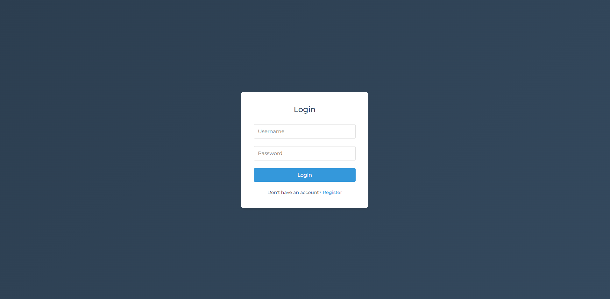
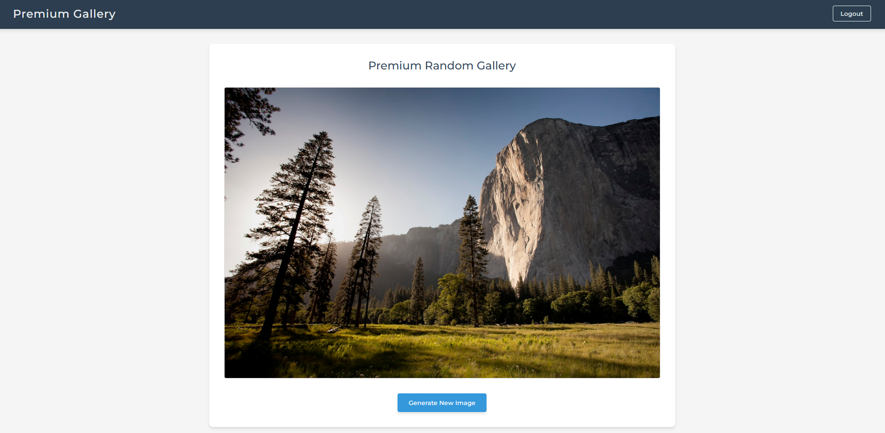

# 📸 Premium Gallery Website

**Premium Gallery Website** is a web application that displays random images for authenticated users. Users must log in to access the gallery, ensuring a secure and personalized experience.
## Website Example





## 🔥 Key Features
- **User Authentication:** Users must register and log in before accessing the gallery.
- **Random Image Display:** A new image is shown each time the user logs in.
- **Secure Authentication:** JWT-based authentication for security.
- **User Management:** Users can update their profile and delete their account.

## 🚀 Technologies Used
- **Frontend:** React + TypeScript
- **Backend:** FastAPI (Python)
- **Database:** MySQL
- **Authentication:** JWT Token
- **Styling:** CSS

## 📌 Installation & Setup

### 1️⃣ Setup Backend (FastAPI)
```bash
cd backend
python -m venv venv
source venv/bin/activate  # macOS/Linux
venv\Scripts\activate  # Windows
pip install -r requirements.txt
uvicorn main:app --reload
```

### 2️⃣ Setup Frontend (React + TypeScript)
```bash
cd frontend
npm install
npm run dev
```

### 3️⃣ Configure `.env` for Backend
Create a `.env` file and add the following settings:
```
MYSQL_HOST=your_mysql_host
MYSQL_USER=your_mysql_user
MYSQL_PASSWORD=your_mysql_password
MYSQL_DATABASE=your_mysql_database
SECRET_KEY=your_secret_key
ALGORITHM=HS256
ACCESS_TOKEN_EXPIRE_MINUTES=30
```

## 📷 Usage
1. Open your browser and go to `http://localhost:5173`
2. Register an account
3. Log in to access the gallery and view random images
4. Click **"Generate New Image"** to get a new random image

## 📬 Contact
For any questions or issues, feel free to reach out via the GitHub repository.

